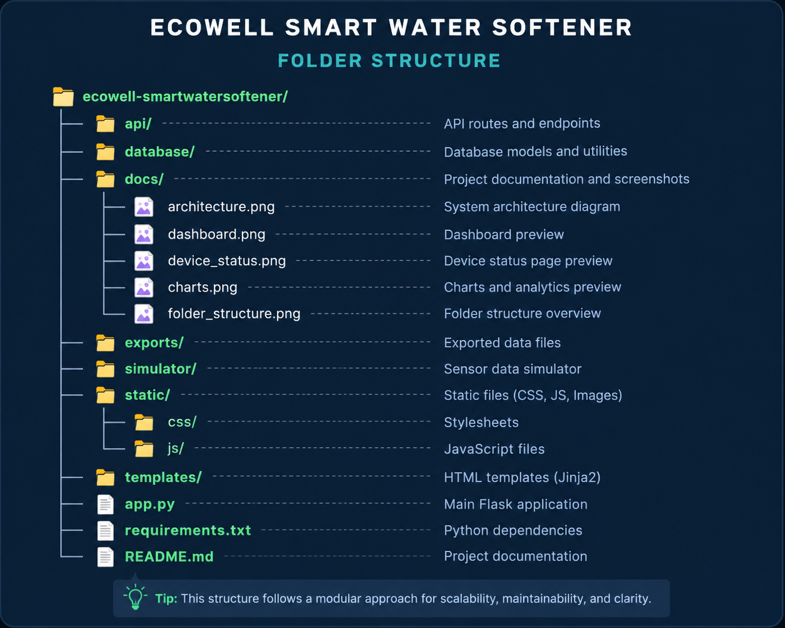
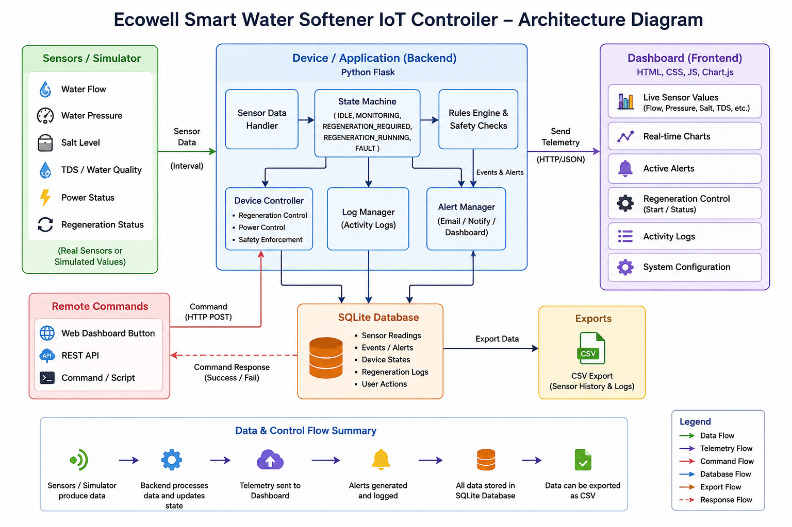
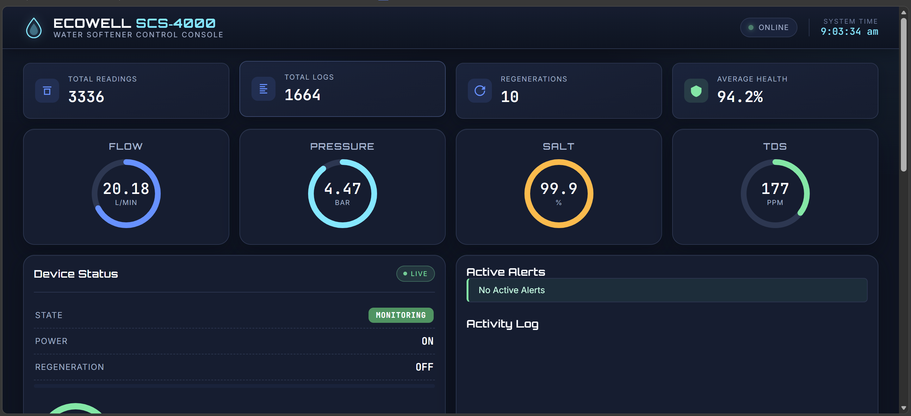
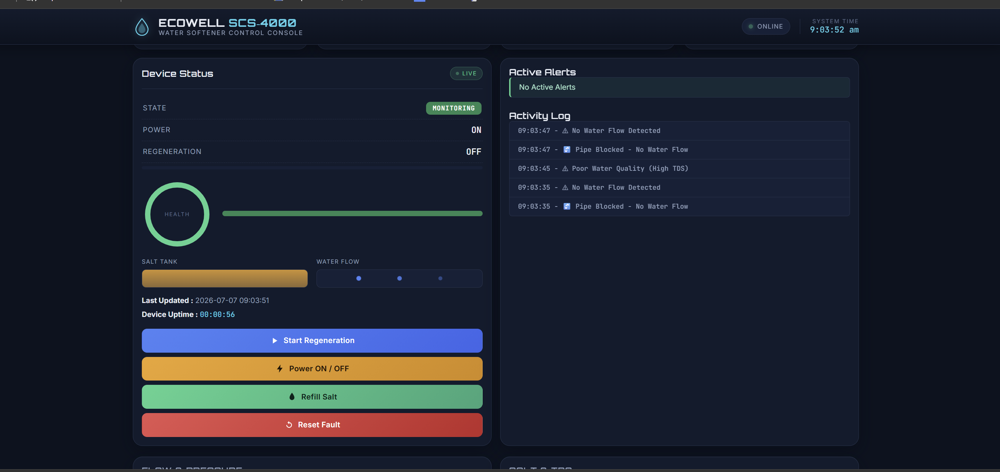
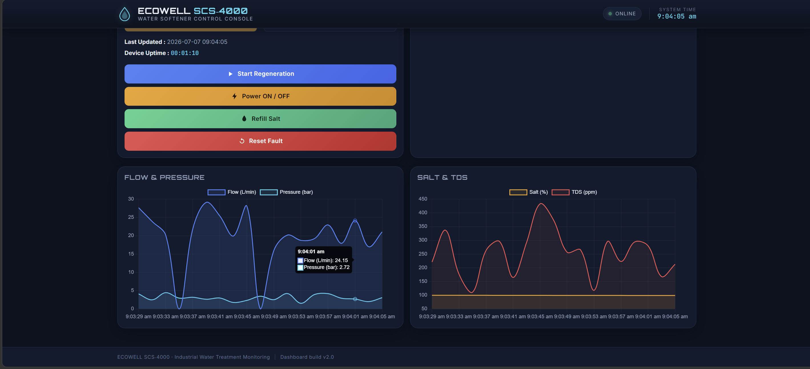

# Ecowell Smart Water Softener Monitoring & Control System

A Flask-based Industrial IoT simulation that monitors and controls a smart water softener in real time. The system simulates water flow, pressure, salt level, Total Dissolved Solids (TDS), device health, alerts, and regeneration through an interactive SCADA-style dashboard.

---

# Project Overview

Traditional water softeners require continuous monitoring to maintain water quality and ensure reliable operation. Manual monitoring can lead to delayed fault detection, inefficient regeneration cycles, and increased maintenance effort.

This project provides a software-based Smart Water Softener Monitoring & Control System that continuously simulates operational parameters, detects abnormal conditions, generates alerts, stores historical data, maintains activity logs, and enables safe remote regeneration using a real-time dashboard.

---

# Features

- Real-Time Sensor Simulation
- Industrial SCADA Dashboard
- Flow Monitoring
- Pressure Monitoring
- Salt Level Monitoring
- TDS Monitoring
- Device Health Gauge
- Device State Monitoring
- Alert Management
- Activity Logging
- Safe Regeneration Control
- Power Control
- Salt Refill
- Fault Reset
- SQLite Database
- CSV Export
- Responsive Bootstrap 5 UI
- Interactive Live Charts using Chart.js

---

# Technology Stack

## Backend

- Python 3
- Flask

## Frontend

- HTML5
- CSS3
- Bootstrap 5
- JavaScript
- Chart.js

## Database

- SQLite

---

# Project Structure

```text
ecowell-smartwatersoftener/
│
├── api/
├── database/
├── docs/
│   ├── architecture.png
│   ├── dashboard.png
│   ├── device_status.png
│   ├── charts.png
│   └── folder_structure.png
├── exports/
├── simulator/
├── static/
│   ├── css/
│   └── js/
├── templates/
├── app.py
├── README.md
└── requirements.txt
```

---

# Folder Structure



---

# System Architecture

The project follows a modular architecture consisting of:

- Sensor Simulation Engine
- Alert Engine
- State Machine
- Flask REST APIs
- SQLite Database
- Interactive Dashboard
- CSV Export Module



---

# Dashboard Overview

The dashboard provides real-time monitoring and remote control through:

- Statistics Cards
- Flow Monitoring
- Pressure Monitoring
- Salt Level Monitoring
- TDS Monitoring
- Device Status
- Device Health Gauge
- Active Alerts
- Activity Logs
- Flow & Pressure Chart
- Salt & TDS Chart
- Power Control
- Regeneration Control
- Salt Refill
- Fault Reset

### Dashboard



### Device Status



### Live Charts



---

# REST API Endpoints

| Endpoint | Method | Description |
|----------|--------|-------------|
| `/dashboard` | GET | Dashboard Interface |
| `/sensor-data` | GET | Live Sensor Data |
| `/stats` | GET | Dashboard Statistics |
| `/history` | GET | Sensor History |
| `/activity` | GET | Activity Logs |
| `/config` | GET | Device Configuration |
| `/config` | POST | Update Configuration |
| `/toggle-power` | POST | Toggle Device Power |
| `/start-regeneration` | POST | Start Regeneration |
| `/refill-salt` | POST | Refill Salt Tank |
| `/reset-fault` | POST | Reset Device Fault |
| `/export-csv` | GET | Export Sensor History |

---

# Safety Checks Before Regeneration

Before regeneration begins, the system validates the following conditions:

- Water pressure must be above the configured minimum threshold.
- Salt level must be above the configured minimum level.
- Device must not already be regenerating.
- Device must not be in a fault condition.
- Failed regeneration events are recorded in the activity log.

These checks help ensure safe and reliable regeneration.

---

# Installation

Clone the repository

```bash
git clone https://github.com/prajwakr/ecowell-smartwatersoftener.git
```

Navigate to the project directory

```bash
cd ecowell-smartwatersoftener
```

Install dependencies

```bash
pip install -r requirements.txt
```

Run the application

```bash
python app.py
```

Open the dashboard

```
http://127.0.0.1:5000/dashboard
```

---

# System Workflow

1. The simulator generates live sensor values.
2. Flask APIs process the sensor data.
3. The State Machine determines the device state.
4. The Alert Engine detects abnormal conditions.
5. Sensor data and activity logs are stored in SQLite.
6. REST APIs update the dashboard in real time.
7. Chart.js continuously refreshes the graphs.
8. Users can remotely perform regeneration, refill salt, toggle power, and reset faults.

---

# Known Limitations

- Uses simulated sensor values.
- No physical IoT hardware integration.
- Runs on a local Flask server.
- SQLite is used for local data storage.
- MQTT communication is not implemented.
- Cloud deployment is not available.
- Mobile application support is not available.

---

# Future Enhancements

- ESP32 Integration
- STM32 Integration
- Arduino Integration
- Physical IoT Sensor Integration
- MQTT Communication
- Cloud Deployment
- Mobile Application
- Email Notifications
- SMS Alerts
- Predictive Maintenance using Machine Learning

---

# Author

**Prajwal KR**

GitHub: https://github.com/prajwakr

---

# License

This project was developed as part of the **Ecowell Smart Water Softener Technical Assignment** and is intended for demonstration, evaluation, and learning purposes.